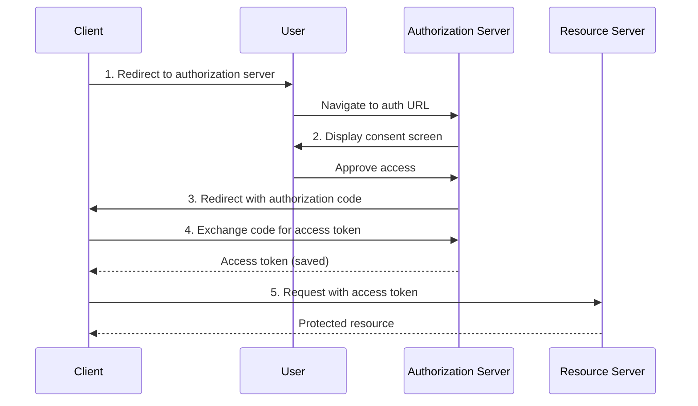
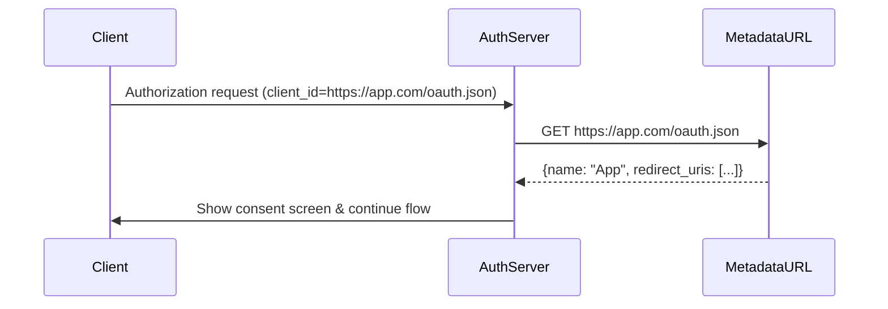

+++
date = '2025-08-22T10:00:00Z'
draft = false
title = 'Evolving OAuth Client Registration in the Model Context Protocol'
author = 'Paul Carleton (Core Maintainer)'
tags = ['security', 'authorization']
+++

The Model Context Protocol (MCP) has adopted OAuth 2.1 as the foundation for its authorization framework. A key part of the authorization flow that MCP is particularly reliant on is **client registration**.

This is especially important in a world where clients and servers don't have a pre-existing relationship - we can't assume that we will always know which MCP clients will connect to which MCP servers. This design highlights two challenges that need to be addressed:

- Operational issues with managing client IDs via [Dynamic Client Registration](https://datatracker.ietf.org/doc/html/rfc7591) (DCR)
- Preventing client impersonation

If you're already familiar with OAuth and the current state of client registration in MCP, skip to [Two Distinct Challenges in MCP Client Registration](#two-distinct-challenges-in-mcp-client-registration).

## Background on OAuth

A protected MCP server that implements OAuth 2.1 should allow a user to grant a client access to itself and prevent attempts to trick the user into granting access to a client they didn't intend to use via phishing.

The authorization flow can be best described by looking at this sequence diagram:

This flow requires a few steps to be performed to acquire an access token:

1. The client directs the user to an authorization UI provided by the authorization server
2. The authorization server displays a consent screen to the user
3. User approves client access and the authorization server redirects the user back to the client with an access code
4. Client exchanges the access code for a set of tokens, which are cached locally
5. Client uses the access token to access the MCP server

To be able to initiate this flow, however, the authorization server first needs some basic information about the client that is kicking off the authorization process:

1. **Client name**: Human readable text to display in the consent screen to help the user decide whether they want to grant access.
2. **Redirect URL**: The destination to send the authorization code back to if the user consents.

In order to prevent a malicious client from tricking a user into granting access they didn't intend to grant, the authorization server must be able to trust the client information it has.

For example, a malicious client could claim to be `Claude Desktop` on the consent screen while actually being owned by someone not affiliated with Claude Desktop developers. Seeing the client information on the consent screen, users might grant access thinking they're authorizing the legitimate Claude Desktop, not realizing that some malicious client now has access to their account.

## Improving Client Registration in MCP

For MCP users, a common pattern is to connect to an MCP server by using its URL directly in a MCP client.

This goes against the typical OAuth authorization pattern because the user is selecting the resource server to connect to rather than the client developer. This problem is compounded by the fact that there is an unbounded number of authorization servers that a MCP server may use, meaning that clients need to be able to complete the authorization flow regardless of the provider used.

Some client developers have implemented pre-registration with a select few authorization servers. In this scenario, the client doesn't need to rely on DCR when it detects an authorization server it knows. However, this is a solution that doesn't scale given the breadth of the MCP ecosystem - it's impossible to have every client be registered with every authorization server there is.
To mitigate this challenge, we set out to outline some of the goals that we wanted to achieve with improving the client registration experience:

1. **Clients**: Client developers don't need to implement pre-registration and distribute a client ID for each authorization server MCP servers might be using.
2. **Users**: Users don't need to go through a pre-registration process themselves and manually specify a client ID for every MCP server they connect to.
3. **Authorization servers**:

- **Trust in Metadata**: Authorization servers have a way to trust the metadata they associate with a client, such as name and redirect URL.
- **Single Client ID per App**: Authorization servers can have a single client ID per client for governance and management purposes
- **Selective Allow/Deny**: Authorization servers can selectively allow or deny clients based on their policies.
- **Database Management**: Authorization servers do not need to handle an unbounded database or expiration flows for every new client registration.

Currently, none of our existing client registration approaches satisfy all of these requirements. Pre-registration requires too much effort in a highly variable setting (unbounded number of clients connecting to unbounded number of servers), while DCR reduces effort but creates operational issues that a lot of the authorization servers are not ready to tackle yet.

## Two Distinct Challenges in MCP Client Registration

After extensive discussion with MCP server implementers, we've identified that a few competing solutions to the registration problem were addressing two distinct issues:

1. **Operational limitations** of Dynamic Client Registration in open environments
2. **Client identity and impersonation** risks across different deployment scenarios

## **Challenge 1: Operational Limitations of Dynamic Client Registration**

### **The DCR Model Mismatch**

The DCR design takes the pre-registration pattern available in modern OAuth-based authorization servers and makes it available via an API. In fully open environments like MCP, DCR really puts the spotlight on a few operational challenges that an open registration endpoint introduces:

**For authorization servers:**

- **Unbounded database growth**: Every time a user connects a client to an MCP server, a new registration is created with the authorization server unless the client already has one. Registrations are also not portable, so using Claude Desktop on your Windows machine, and then jumping to Claude Desktop on macOS will create two distinct client registrations.
- **Client expiry "black hole"**: There's no way to tell a client that its ID is invalid without creating an open redirect vulnerability. Clients have to implement their own heuristics for client ID management.
- **Per-instance confusion**: Each client instance typically gets its own client ID even when using the same application, but on different machines or across different users. From an auditing perspective, an authorization server administrator may see hundreds (if not thousands) of records for the same application without any rhyme or reason.
- **Denial-of-Service vulnerability**: An unauthenticated `/register` endpoint writes to a database within the authorization server, meaning that tenant admins now need to worry about rate limiting or policy controls (e.g., hosts allowed to register clients).

**For clients:**

- **Extra overhead**: Managing registration state and another secret beyond access/refresh tokens
- **No validity checking**: Can't verify if a client ID is still valid
- **Unclear lifecycle**: No guidance on when to re-register or update credentials

### **Solution: Client ID Metadata Documents (CIMD)**

Client ID Metadata Documents (CIMD), described in [OAuth Client ID Metadata Document](https://www.ietf.org/archive/id/draft-parecki-oauth-client-id-metadata-document-03.html) and implemented by Bluesky, elegantly sidestep these operational issues.

Instead of a registration step, clients use an HTTPS metadata URL as their client ID directly. The server fetches the metadata from the URL at authorization time:

This addresses all the operational issues:

- **No unbounded database growth**: Servers fetch metadata on-demand (can cache for performance)
- **No expiry management**: The URL is the ID \- it doesn't expire
- **Natural per-app model**: One URL per application, not per user
- **No registration endpoint**: No unauthenticated write operations

The cost? Clients need to host a metadata document at an HTTPS URL. For web applications, this is trivial. For desktop applications, this typically means hosting on their backend infrastructure.

## **Challenge 2: Client Identity and Impersonation**

The second challenge is orthogonal to the DCR vs. CIMD debate \- it's about trusting that a client is who it claims to be. This problem will exist regardless of how the registration process is implemented.

For web-based clients, trust is more straightforward, as we have an HTTPS domain that's tied to a certificate authority. For desktop clients, if the client can't offload its authorization to existing backend infrastructure, there is difficulty trusting the client is legitimate and unmodified.

### The Trust Spectrum

We can map impersonation scenarios on two axes: attacker cost and mitigation complexity.

**Low attacker cost/Low mitigation complexity: Domain-based attacks**

- **Attack**: Register malicious callback URI and claim to be `Claude Desktop`
- **Cost**: Trick user into clicking a link and consenting
- **Mitigation**:
  - Restrict trusted domains/URLs
  - Show warnings for unknown domains
  - Works with both DCR and CIMD

**Medium attacker cost/Medium mitigation complexity: `localhost` impersonation**

- **Attack**: Run malicious app on `localhost:8080`, impersonate legitimate client
- **Cost**: Trick user into running a malicious application (plus consenting for that app to have data access)
- **Problem**: Desktop apps can't hold secrets, hard to prove identity

**High attacker cost/High mitigation complexity: Platform-attested applications**

- **Attack**: Get malicious client signed by a trusted authority
- **Cost**: Extremely high \- requires compromising certification vendor processes
- **Mitigation**: platform system-level attestation (future work)

### **Solution: Software Statements for Desktop Applications**

To broadly solve the client impersonation for the middle tier as well as to prevent `localhost` impersonation we need signed software statements. Implementing this would require:

1. Client hosts a JSON Web Key Set (JWKS) on their backend
2. Client authenticates the user through their own flow
3. The client-owned backend service issues a short-lived, signed JWT attesting to the client's identity
4. Client includes this JWT in the OAuth flow
5. Authorization server verifies the JWT against the trusted JWKS

This dramatically raises the bar for client impersonation, as an attacker would need to:

- Compromise the client's backend infrastructure, or
- Successfully impersonate the client's authentication flow

Crucially, **software statements work with both DCR and CIMD**. They're not a competing solution \- they're a complementary security layer.

### **Future: Platform-Level Attestation**

The strongest protection would be platform-level attestation, e.g. having macOS, Windows, or Android attest that a piece of software is legitimate.

Having OS-level attestation would make client impersonation unreasonably expensive. While the exact way this ties into a software statement is yet to be prototyped, the general direction is threading platform-level application identity validation through to the OAuth flow.

## **The Complementary Path Forward**

While we're looking at all available options, it's important to note that we're not choosing between solutions. We're exploring complementary approaches for distinct problems:

**For operational issues**: We are looking at adding CIMD support in favor of DCR

- Keep DCR for backward compatibility
- Recommend CIMD for new implementations
- Both achieve the same authorization goal

**For trust issues**: Layering software statements on top

- Optional enhancement for both DCR and CIMD
- Required only when `localhost` impersonation is a concern
- Authorization servers choose their required trust level

## **Security Considerations**

Both CIMD and software statements require authorization servers to make outbound HTTPS requests, potentially to untrusted domains. Implementations must:

- Prevent SSRF attacks by blocking internal network access
- Implement timeouts and size limits
- Consider caching strategies for performance
- Validate response formats strictly

If we adopt these approaches, we’ll need good best practices and SDK support to help avoid vulnerabilities and provide a easy path for implementors.

## **Next Steps**

Discussions for these approaches are happening in the [Specification Enhancement Proposals](https://modelcontextprotocol.io/community/sep-guidelines) (SEP):

- [SEP-991: Client ID Metadata Documents](https://github.com/modelcontextprotocol/specification/discussions/991)
- [SEP-1032: Software Statements with DCR](https://github.com/modelcontextprotocol/specification/discussions/1032)

Get involved: Join the conversation in [Discord](https://discord.gg/6CSzBmMkjX) (the \#auth-wg-client-registration channel) or comment on the SEPs directly.

A big thank to the following folks for help with this blog post: Den Delimarsky, Aaron Parecki, Geoff Goodman, Andrew Block, Pieter Kasselman, Abhishek Hingnikar, and Bobby Tiernay.
