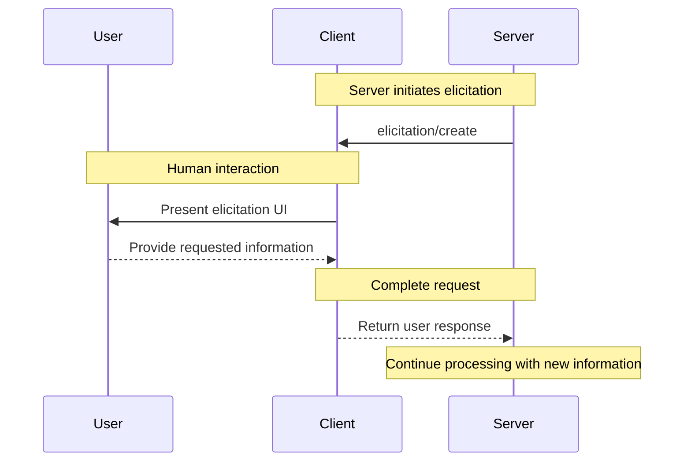

Elicitation is a powerful MCP feature that allows servers to request additional information from users during interactions. This enables dynamic workflows where servers can gather necessary data on-demand while maintaining user control and privacy.

<Info>
  Elicitation is newly introduced in the MCP specification [revision
  2025-06-18](/specification/2025-06-18/client/elicitation).
</Info>

## What is Elicitation?

Elicitation provides a standardized way for MCP servers to request structured information from users through the client. Instead of requiring all information upfront, servers can ask for specific data exactly when needed, creating more natural and flexible interactions.

For example, a server might:

- Request a username when connecting to a service
- Ask for configuration preferences during setup
- Gather project details when creating new resources

## How Elicitation Works

The elicitation flow is straightforward:

1. Server sends an elicitation request with a message and expected data structure
2. Client presents the request to the user with appropriate UI
3. User accepts, declines, or cancels the request
4. Client validates and returns the response to the server
5. Server continues processing with the provided information

## Request Structure

Elicitation requests include two key components:

### Message

A clear, human-readable explanation of what information is needed and why.

### Schema

A JSON Schema that defines the expected structure of the response. The schema is intentionally limited to flat objects with primitive types to simplify client implementation.

Example request:

```json
{
  "message": "Please provide your GitHub username",
  "requestedSchema": {
    "type": "object",
    "properties": {
      "username": {
        "type": "string",
        "title": "GitHub Username",
        "description": "Your GitHub username (e.g., octocat)"
      }
    },
    "required": ["username"]
  }
}
```

## Supported Data Types

Elicitation supports these primitive types:

### Text Input

```json
{
  "type": "string",
  "title": "Project Name",
  "description": "Name for your new project",
  "minLength": 3,
  "maxLength": 50,
  "default": "my-project"
}
```

### Numbers

```json
{
  "type": "number",
  "title": "Port Number",
  "description": "Port to run the server on",
  "minimum": 1024,
  "maximum": 65535,
  "default": 3000
}
```

### Boolean Choices

```json
{
  "type": "boolean",
  "title": "Enable Analytics",
  "description": "Send anonymous usage statistics",
  "default": false
}
```

### Selection Lists

```json
{
  "type": "string",
  "title": "Environment",
  "enum": ["development", "staging", "production"],
  "enumNames": ["Development", "Staging", "Production"],
  "default": "development"
}
```

## User Response Actions

Users can respond to elicitation requests in three ways:

1. **Accept**: User provides the requested information
2. **Decline**: User explicitly refuses to provide information
3. **Cancel**: User dismisses without making a choice (e.g., closes dialog)

Servers should handle each response appropriately:

- Accept → Process the provided data
- Decline → Offer alternatives or adjust workflow
- Cancel → Consider retrying later or using defaults

## Best Practices

When implementing elicitation:

### For Servers

1. **Be Clear**: Write descriptive messages explaining why information is needed
2. **Be Minimal**: Only request essential information
3. **Be Flexible**: Have fallbacks for declined or cancelled requests
4. **Be Timely**: Request information when actually needed, not preemptively
5. **Be Respectful**: Never request sensitive information like passwords or tokens

### For Clients

1. **Be Transparent**: Clearly show which server is requesting information
2. **Be Protective**: Allow users to review and modify responses
3. **Be Validating**: Check responses against the provided schema
4. **Be Empowering**: Make decline and cancel options prominent
5. **Be Limiting**: Implement rate limiting to prevent spam

## Common Use Cases

Elicitation excels in scenarios like:

- **Initial Setup**: Gathering configuration during first-time setup
- **Dynamic Workflows**: Requesting context-specific information
- **User Preferences**: Collecting optional settings and preferences
- **Project Details**: Gathering metadata about resources being created
- **Service Integration**: Requesting usernames or IDs for external services

## Example Workflow

Here's a typical elicitation interaction:



## Security Considerations

<Warning>
  Servers must never use elicitation to request passwords, API keys, tokens, or
  other sensitive credentials. Use proper authentication flows instead.
</Warning>

Key security guidelines:

1. Servers should only request non-sensitive information
2. Clients should clearly indicate which server is requesting data
3. Users should always have the option to decline
4. Responses should be validated against the schema
5. Rate limiting should prevent request flooding

## Implementation Example

Here's how a server might use elicitation to gather project information:

```typescript
// Server requests project details
const response = await client.request("elicitation/create", {
  message: "Let's set up your new project",
  requestedSchema: {
    type: "object",
    properties: {
      name: {
        type: "string",
        title: "Project Name",
        description: "A descriptive name for your project",
      },
      framework: {
        type: "string",
        title: "Framework",
        enum: ["react", "vue", "angular", "none"],
        enumNames: ["React", "Vue", "Angular", "None"],
      },
      useTypeScript: {
        type: "boolean",
        title: "Use TypeScript",
        default: true,
      },
      port: {
        type: "number",
        title: "Development Port",
        description: "Port number for the dev server",
        default: 3000,
      },
    },
    required: ["name", "framework"],
  },
});

// Handle the response
if (response.action === "accept") {
  // Create project with provided details
  await createProject(response.content);
} else if (response.action === "decline") {
  // Use defaults or offer alternatives
  await createDefaultProject();
} else {
  // User cancelled - perhaps retry later
  console.log("Project creation cancelled");
}
```

This approach creates a smooth, interactive experience while respecting user control and privacy.
