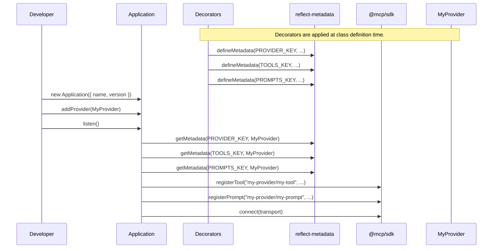

# MCP-Kit

[](https://badge.fury.io/js/%40viniciuscsouza%2Fmcp-kit)

A decorator-based framework for building Model Context Protocol (MCP) servers in TypeScript.

MCP-Kit simplifies the process of creating MCP servers by providing a clear, declarative, and organized structure using decorators. It handles the boilerplate of registering tools and prompts, allowing you to focus on implementing your server's capabilities.

## Core Concepts

The framework is built around three main decorators:

-   `@Provider`: A class decorator that groups a set of related capabilities.
-   `@Tool`: A method decorator that defines a tool that can be called by an MCP client.
-   `@Prompt`: A method decorator that defines a prompt that can be used to generate content.

The `Application` class is the heart of the framework, responsible for discovering and managing these decorated classes and methods.

## Architecture

MCP-Kit acts as a layer on top of the official `@modelcontextprotocol/sdk`. It uses `reflect-metadata` to gather information from the decorators and then uses the SDK to register the capabilities with an `McpServer` instance.

This approach promotes a clean separation of concerns, where providers and their capabilities are self-contained and the `Application` class orchestrates their registration.

```mermaid
graph TD
    subgraph "Your Code"
        A[Application]
        P1[MyProvider]
    end

    subgraph "MyProvider"
        T1["@Tool<br>myTool()"]
        PR1["@Prompt<br>myPrompt()"]
    end

    subgraph "MCP-Kit Framework"
        style Decorators fill:#ffc,stroke:#333,stroke-width:2px
        Decorators[Decorators<br>@Provider, @Tool, @Prompt]
        Metadata[reflect-metadata]
    end

    subgraph "@modelcontextprotocol/sdk"
        style SDK fill:#9f9,stroke:#333,stroke-width:2px
        SDK[McpServer]
    end

    A -- adds --> P1
    P1 -- decorated with --> Decorators
    Decorators -- stores data in --> Metadata

    A -- on listen() reads --> Metadata
    A -- registers capabilities with --> SDK

    SDK -- communicates via --> Transport[MCP Transport<br>(e.g., Stdio)]

    style A fill:#f9f,stroke:#333,stroke-width:2px
```

### Lifecycle

The following diagram illustrates the sequence of events from defining a provider to running the server.



## Getting Started

### 1. Installation

```bash
npm install @viniciuscsouza/mcp-kit reflect-metadata zod
```

### 2. Enable Decorators in `tsconfig.json`

You need to enable `experimentalDecorators` and `emitDecoratorMetadata` in your `tsconfig.json`:

```json
{
  "compilerOptions": {
    "experimentalDecorators": true,
    "emitDecoratorMetadata": true
    // ... other options
  }
}
```

### 3. Create a Provider

Create a file for your provider, for example, `src/hello.provider.ts`:

```typescript
import { Provider, Tool } from '@viniciuscsouza/mcp-kit';
import { z } from 'zod';

@Provider({
  name: 'hello',
  description: 'A simple provider that can say hello.',
})
export class HelloProvider {
  @Tool({
    id: 'world',
    description: 'Greets the world or a specific person.',
    inputSchema: z.object({
      name: z.string().optional(),
    }),
  })
  helloWorld(input: { name?: string }) {
    const target = input.name || 'World';
    const message = `Hello, ${target}!`;
    console.log(`[HelloProvider] Returning message: ${message}`);
    return {
      content: [{ text: message }],
    };
  }
}
```

### 4. Create the Application Entrypoint

Create your main application file, for example, `src/main.ts`:

```typescript
import 'reflect-metadata';
import { Application } from '@viniciuscsouza/mcp-kit';
import { HelloProvider } from './hello.provider';

async function main() {
  // Create a new application instance
  const app = new Application({
    name: 'my-mcp-server',
    version: '1.0.0',
  });

  // Add your providers
  app.addProvider(HelloProvider);

  // Start the server
  await app.listen();
}

main().catch(console.error);
```

### 5. Run the Application

Compile and run your application:

```bash
npx tsx src/main.ts
```

## API Reference

### `Application`

The main class to orchestrate the server.

-   `constructor(options: ApplicationOptions)`: Creates a new application.
    -   `options.name`: The name of your server.
    -   `options.version`: The version of your server.
-   `addProvider(provider: ProviderClass)`: Adds a provider class to the application.
-   `listen(transport?: StdioServerTransport)`: Starts the server, registers all capabilities, and connects to the specified transport. Defaults to `StdioServerTransport`.

### `@Provider(options: ProviderOptions)`

A class decorator.

-   `options.name`: (Required) The name of the provider. This acts as a namespace for all tools and prompts within it.
-   `options.description`: (Required) A description of the provider.

### `@Tool(options: ToolOptions)`

A method decorator.

-   `options.id`: (Required) The ID of the tool, unique within the provider. The final capability ID will be `{providerName}/{toolId}`.
-   `options.description`: (Required) A description of what the tool does.
-   `options.inputSchema`: (Optional) A `zod` object schema to validate the tool's input.
-   `options.outputSchema`: (Optional) A `zod` object schema for documenting the tool's output.

### `@Prompt(options: PromptOptions)`

A method decorator.

-   `options.id`: (Required) The ID of the prompt, unique within the provider. The final capability ID will be `{providerName}/{promptId}`.
-   `options.description`: (Required) A description of what the prompt does.
-   `options.inputSchema`: (Optional) A `zod` object schema to validate the prompt's input.

## Development

To work on this project locally:

1.  Clone the repository.
2.  Install dependencies: `npm install`
3.  Build the project: `npm run build`
4.  Run tests: `npm run test`
